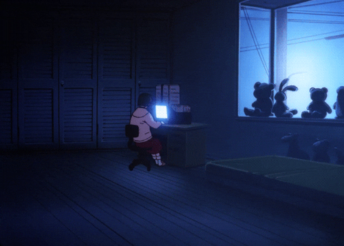

## About me

My name is Arnaud, and I'm interested in operating systems, low-level programming and computer graphics.

## 🔭 Things I use

### 💻 Programming Languages

  
  
  
  
  

### 🛠 Tools

  
  
  
  
  
  
  

### 💡 Platforms

  
  

## 🚀 Currently Learning

  

## 📊 GitHub Stats

<!--
**xephir64/xephir64** is a ✨ _special_ ✨ repository because its `README.md` (this file) appears on your GitHub profile.

Here are some ideas to get you started:

- 🔭 I’m currently working on ...
- 🌱 I’m currently learning ...
- 👯 I’m looking to collaborate on ...
- 🤔 I’m looking for help with ...
- 💬 Ask me about ...
- 📫 How to reach me: ...
- 😄 Pronouns: ...
- ⚡ Fun fact: ...
-->
